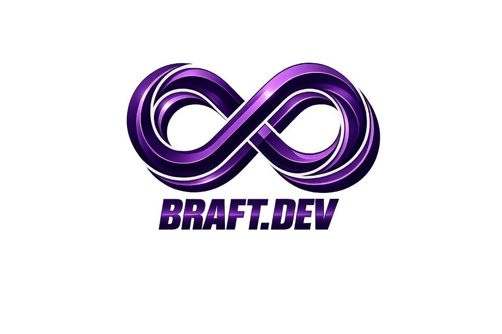

# BRaft.Dev — World-Class Web Agency & Digital Template Marketplace

<div align="center">



### **Agensi Pembuatan Website Custom Berkelas Dunia & Marketplace Template Siap Pakai**

[](https://vitejs.dev/)
[](https://reactjs.org/)
[](https://www.typescriptlang.org/)
[](https://tailwindcss.com/)
[](https://www.framer.com/motion/)
[](https://lenis.darkroom.engineering/)

</div>

---

## 🌟 Tentang BRaft.Dev

**BRaft.Dev** adalah platform modern yang menggabungkan dua layanan utama: **Jasa Pembuatan Website Custom** (perusahaan, startup, e-commerce) dan **Marketplace Template UI Premium Siap Pakai** (UMKM, freelancer, bisnis pemula). 

Dirancang dengan standar UI/UX tingkat tinggi (*Dark Mode Glassmorphism, 100% Solid Black Cards, 1.5px Neon Purple Border, dan Lenis Smooth Scroll Engine*).

---

## 🚀 Fitur Utama

### 1. 💼 Solusi Pembuatan Website Custom (Agency Service)
- **Project Cost Estimator & Calculator**: Kalkulator estimasi biaya proyek interaktif real-time berbasis pilihan tipe website, fitur tambahan (Payment Gateway, SEO, Multilingual, Admin CMS, AI Chatbot), dan kecepatan pengerjaan (*Normal, Fast Track, Express*).
- **1-Click WhatsApp Consultation Flow**: Terhubung langsung dengan konsultan senior agency via WhatsApp lengkap dengan draf konteks proyek.
- **Transparansi Garansi & Support**: Garansi tepat waktu, maintenance 3 bulan, dan akses source code 100%.

### 2. 🛒 Marketplace Template UI Siap Pakai (Digital Marketplace)
- **Katalog Template Siap Pakai**: Berbagai template landing page, toko online, dan dashboard modern dengan live preview demo.
- **Flexible License Model**: Opsi lisensi *Personal*, *Commercial*, dan *Extended*.
- **Cart & Instant Inquiry System**: Kemudahan checkout dan konsultasi langsung dengan admin.

### 3. 🎨 Design System & Animation Framework
- **Pure 3D Infinity Metallic Brand Logo**: Identitas visual branding modern tanpa kotak frame.
- **Lenis Smooth Scroll**: Pengalaman navigasi scroll inersia yang sangat halus dan responsif.
- **Solid Black Card & Neon Border**: Arsitektur kartu `#09090b` dengan garis border ungu neon 1.5px/2px presisi.
- **Dukungan Dwiguna Bahasa (i18next)**: Mendukung Bahasa Indonesia & English secara lengkap.

---

## 🛠️ Teknologi & Stack

- **Core**: [React 19](https://react.dev/), [TypeScript](https://www.typescriptlang.org/), [Vite](https://vitejs.dev/)
- **Styling**: [Tailwind CSS v4](https://tailwindcss.com/), Vanilla CSS Tokens
- **Animasi & Interaksi**: [Framer Motion](https://www.framer.com/motion/), [Lenis Smooth Scroll](https://lenis.darkroom.engineering/)
- **State Management**: [Zustand](https://github.com/pmndrs/zustand)
- **Data Fetching & Backend**: [React Query](https://tanstack.com/query), [Supabase](https://supabase.com/)
- **Icon Set**: [Lucide React](https://lucide.dev/)
- **Internationalization**: [i18next](https://www.i18next.com/)

---

## 📁 Struktur Proyek

```text
BRaft-Project/
├── public/                  # Logo resmi (braft-logo.png), favicon, assets
├── src/
│   ├── assets/              # Gambar hero & grafis pendukung
│   ├── components/
│   │   ├── cart/            # Drawer keranjang belanja
│   │   ├── chat/            # Widget live chat
│   │   ├── layout/          # Navbar, Footer, PublicLayout, AdminLayout, SellerLayout
│   │   ├── sections/        # Section utama (Hero, Estimator, Services, Templates, FAQ, CTA)
│   │   └── ui/              # Design System (BraftLogo, Card, YieldCard, Button, Badge, SmoothScroll)
│   ├── config/              # Konfigurasi i18n & kamus terjemahan (id/en)
│   ├── data/                # Mock data layanan & template
│   ├── guards/              # Auth & Role routing guards
│   ├── lib/                 # Utilitas & Supabase client integration
│   ├── pages/               # Halaman publik (Home, Services, Templates, Pricing, Contact, FAQ) & Admin
│   ├── routes/              # Routing utama aplikasi
│   ├── stores/              # State management (authStore, cartStore, uiStore)
│   ├── types/               # Definisi TypeScript interfaces
│   ├── App.tsx              # Root component & SmoothScroll provider
│   ├── index.css            # Token CSS & Lenis custom scroll rules
│   └── main.tsx             # Entry point React
├── package.json             # Manifest dependensi & scripts
├── tsconfig.json            # Konfigurasi TypeScript
├── vite.config.ts           # Konfigurasi bundler Vite
└── README.md                # Dokumentasi resmi proyek
```

---

## ⚡ Cara Menjalankan Proyek di Lokal

### 1. Prasyarat
- [Node.js](https://nodejs.org/) v18.0.0 atau yang lebih baru
- `npm` v9.0.0 atau yang lebih baru

### 2. Kloning Repositori
```bash
git clone https://github.com/Medolsky/BRAFT-Web-Project.git
cd BRAFT-Web-Project
```

### 3. Install Dependensi
```bash
npm install
```

### 4. Jalankan Dev Server
```bash
npm run dev
```
Buka browser di `http://localhost:5173`.

### 5. Build untuk Produksi
```bash
npm run build
```
Hasil build produksi akan tersimpan di folder `dist/`.

---

## 👑 Akses Panel Admin (Demo)

Untuk masuk ke **Dashboard Super Admin Panel**:
- Buka halaman **Login** (`/login`).
- Ketikkan email yang mengandung kata `admin` (contoh: `admin@braft.dev`).
- Anda akan otomatis di-redirect ke **Dashboard Admin** (`/admin`).

---

## 📝 Lisensi & Hak Cipta

© 2026 **BRaft.Dev**. Seluruh hak cipta dilindungi undang-undang.
Dibuat dengan ❤️ oleh Tim Developer **BRaft.Dev**.
